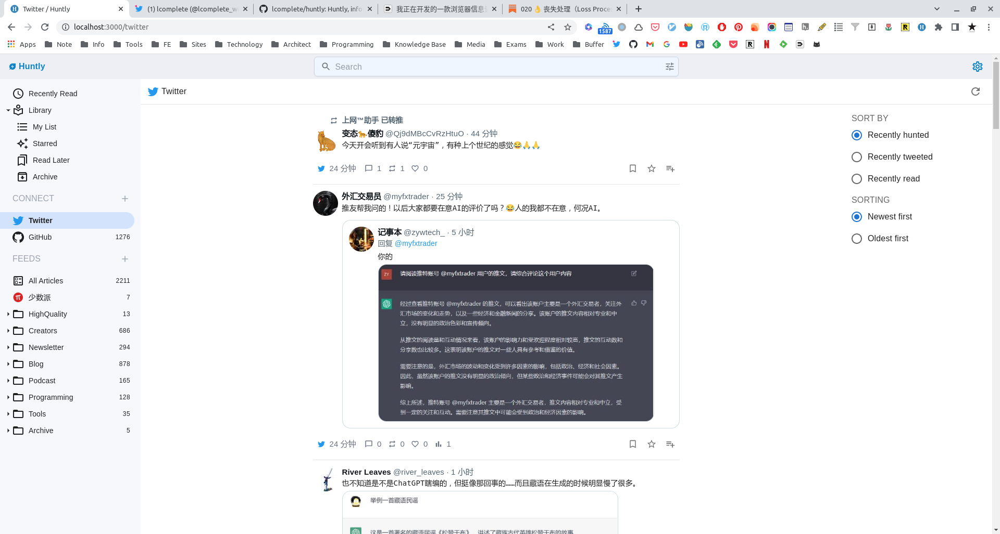

# Huntly

**English** | [中文](./README.md)

Huntly is a self-hosted information management tool, in simple terms, contains the following features.

- RSS subscription and reading.
- Automatically saves the pages that have been viewed， then you can saves them as read later, favorites or archives.
- There is a special treatment for Twitter sites that automatically saves the requested tweet timeline, recording whether it has been viewed or not, and in huntly you can even revisit these tweets in a more convenient way.
- You can search by title, content, type, favorite method, and other dimensions.
- Connect to other services, currently GitHub is supported, so it's also a Github stars management tool.
- In the future, it may support connections to services like Pocket, Hypothesis, etc.

# Demo

Website: [http://huntly.rom666.com:8000/](http://huntly.rom666.com:8000/)

Username: demo

Password: huntlydemo

# Screenshot




# Requirements

- Java 11

# Usage

## Running the server side

You can use docker or java to run the server.

### Run with docker

```sh
mkdir huntly && cd huntly
docker run -itd --name huntly --restart=always -p <host port>:80 -v `pwd`/data:/data lcomplete/huntly
```

always pull the latest image. if you need to upgrade, you can delete the local latest image and run the startup command again.


### Run with the Java command

Download the jar package from [Releases](https://github.com/lcomplete/huntly/releases), in which the react client is also packaged.

After downloading, cd to the current directory from the command line and run it with the following Java command.

```sh
java -Xms128m -Xmx1024m -jar huntly-server-0.1.0-SNAPSHOT.jar
```

By default it runs on port 8080, you can open the [http://localhost:8080/](http://localhost:8080/) port for access, or if you need to use another port, such as port 80, you can run the following command.


```sh
java -Xms128m -Xmx1024m -jar huntly-server-0.1.0-SNAPSHOT.jar --server.port=80
```

Note that the Jar package name needs to be modified appropriately according to the downloaded package name.

## Install the browser extension

Note: The plugin is still under development and is not yet available on the Google Play Store.

Download the browser-extension.zip from [Releases](https://github.com/lcomplete/huntly/releases) and unpack it.

Manage the extension in your browser, enable developer mode, and load the unpacked extension.

## Browser extension settings

Click the huntly extension icon, choose to set huntly's server address, for example, when using the demo server, then set it to http://huntly.rom666.com:8000/, for the remote address, in formal use, it is highly recommended to use the https protocol, after all, the browsing history is quite private. If the server is running locally, then set it to the local address.

## Login and enjoy it

When you open huntly website for the first time, you will be prompted to register an administrator user, currently only single user is supported.

After registration, you will be automatically logged into the system, and the huntly extension will only send browsing history to the server if you are logged in.

Enjoy it.
